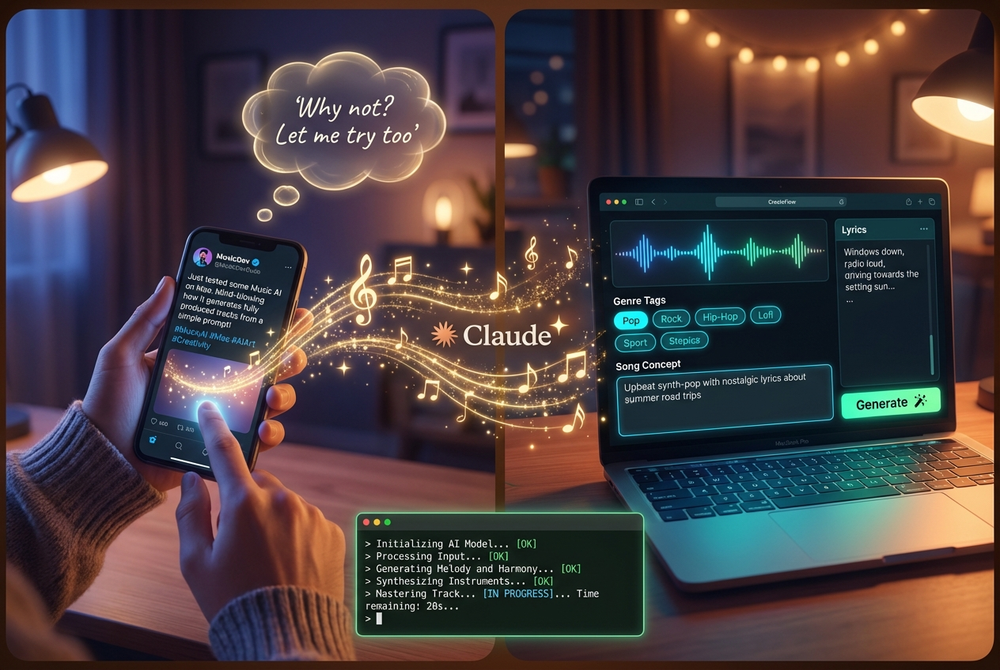

# ACE-Step on Mac: From Tweet to Music Studio in 20 Minutes



## The Story

I saw [this tweet by @AmbsdOP](https://x.com/AmbsdOP/status/2018735590930518175?s=20) about running ACE-Step 1.5 — a Suno-level AI music generation model — locally on a Mac. No cloud, no subscription, no dependencies on external providers. Just your hardware, your music.

I thought: "Why not? I have a Mac, let me try."

So I gave [Claude Code](https://claude.ai/claude-code) a **literal screenshot of the tweet** and said: "Make me one too."

Claude ran in the background — cloned repos, installed dependencies, downloaded models, configured the MLX backend for Apple Silicon, wired up the frontend and backend, and launched everything.

**~20 minutes later**, a browser window opened with a full music production studio.

One small error on the first generation attempt. I sent Claude the error message. A few quick fixes later...

**It just worked.**

Full AI music generation. Running 100% locally on my Mac. Metal GPU acceleration via MLX. No Python knowledge required. No cloud API. No subscription fees.

## What This Is

A local deployment of:

- **[ACE-Step 1.5](https://github.com/ace-step/ACE-Step-1.5)** — Open-source AI music generation model (MIT license)
- **[ACE-Step UI](https://github.com/fspecii/ace-step-ui)** by [@AmbsdOP](https://x.com/AmbsdOP) — Professional React/TypeScript frontend

Running on Apple Silicon with the **MLX backend** for native Metal GPU acceleration.

### Features

- Full song generation from text prompts
- Style selection (Pop, Rock, Hip-Hop, Jazz, Classical, Lo-fi, and more)
- Lyrics editor with persona/voice styles
- Audio editor + stem separation (Demucs)
- Song library with favorites
- Runs 100% offline after initial model download (~10GB)

## Quick Start (macOS Apple Silicon)

### Prerequisites

- **Node.js** 18+
- **Python** 3.11+ (3.11-3.12 recommended)
- **uv** — Python package manager
- **FFmpeg** — for audio processing
- **Git**

### Install

```bash
# 1. Clone this repo
git clone https://github.com/aviz85/ace-step.git
cd ace-step

# 2. Clone ACE-Step 1.5 backend (as sibling directory)
cd ..
git clone https://github.com/ACE-Step/ACE-Step-1.5.git
cd ACE-Step-1.5
uv sync
cd ../ace-step

# 3. Install frontend dependencies
npm install
cd server && npm install && cd ..

# 4. Configure
cp server/.env.example server/.env

# 5. Launch everything (models download automatically on first run, ~10GB)
./start-all.sh
```

Open **http://localhost:3000** and start making music.

To stop: `./stop-all.sh`

## Credits

- **[ACE-Step 1.5](https://github.com/ace-step/ACE-Step-1.5)** by the ACE-Step team — the AI model that makes it all possible
- **[ACE-Step UI](https://github.com/fspecii/ace-step-ui)** by [Vali Neagu (@AmbsdOP)](https://x.com/AmbsdOP) — the beautiful frontend that inspired this whole thing
- **[MLX](https://github.com/ml-explore/mlx)** by Apple — native Apple Silicon ML framework
- **[Claude Code](https://claude.ai/claude-code)** by Anthropic — the AI agent that set everything up from a screenshot

## License

This deployment setup follows the licenses of the underlying projects:
- ACE-Step 1.5: MIT License
- ACE-Step UI: See [original repo](https://github.com/fspecii/ace-step-ui)
